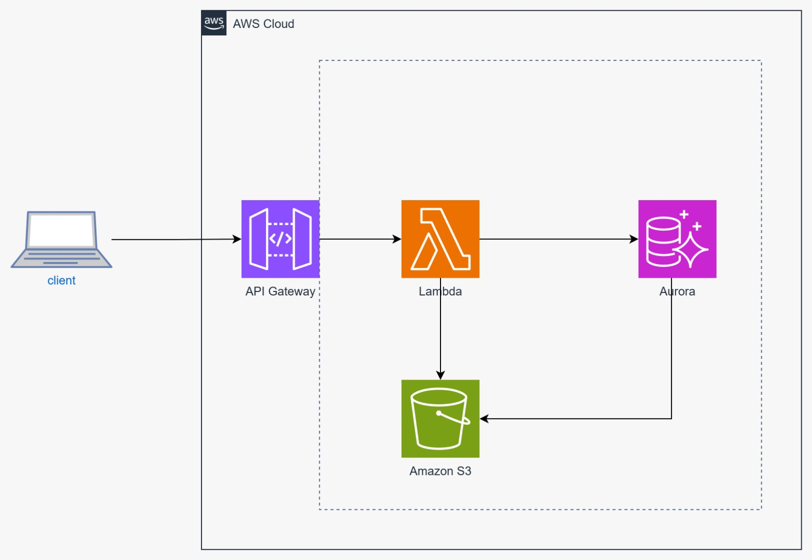

# Flask API for Database Migration

This API allows uploading historical data from CSV files into a SQL database. Built for flexibility and designed to support batch insertions of up to 1000 records per request.

## Features

- Upload CSV files to populate one of the three tables `departments`,`jobs` and `hired_employees`.
- Batch insert transactions (1-1000 records at a time).
- Automatic duplicate detection to avoid inserting existing records.
- It's working with a sqlite db but it could work with any other database service.
- Clean architecture

## Endpoints

### `POST /upload/<table_name>`
Uploads a CSV file to a target table (`departments`,`jobs` and `hired_employees`).

**Params:**
- `table_name`: Name of the table to populate.

**Form Data:**
- `file`: CSV file to upload.

**Returns:**
- Number of inserted records.
- List of skipped duplicate record IDs.

### `GET /stats/hires-per-quarter-2021`
Gets hirings in 2021 per quarter for each department and job.

**Returns:**
- List of deparment-jobs with hirings per quarter, ordered by deparment and job

### `GET /stats/top-departments-hired`
Gets List of deparments with hires above the mean of employees hirde in 2021

**Returns:**
- List of deparments with the total amount of hirings, ordered by number of hirings.

## How to Run

1. Install dependencies:

```bash
pip install -r requirements.tx
```
install all dependencies.

2. Run the API:

```bash
python app.py
```

## Database Tables

- `departments(id, department)`
- `jobs(id, job)`
- `hired_employees(id, name, datetime, department_id, job_id)`

## Future Improvements and next steps
To build a local REST API we used Flask framework but it could be modernized and scaled using public cloud services. Here is a suggestion with AWS Cloud services.

### Api layer

#### Amazon API Gateway
- To expose the REST API.

#### AWS Lambda
- To build the backend serverless.
- To Read csv files in memory
- To perform batch insertion on database

### Storage

#### Amazon S3
- to store the csv files.

### Database

#### Amazon RDS
- PostgreSQL,  MySQL, MariaDB

#### Amazon Aurora Serverless
- PostgreSQL compatible.


Below we have the suggested architecture
